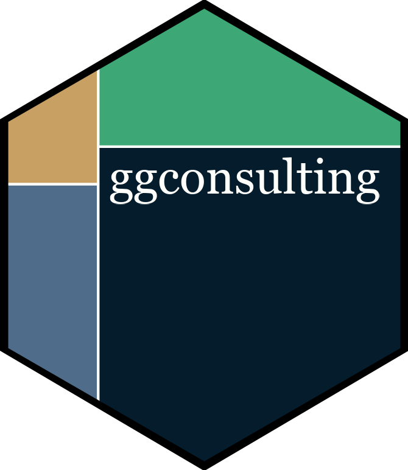

<!-- README.md is generated from README.Rmd. Please edit that file -->

```{r, include = FALSE}
knitr::opts_chunk$set(
  collapse = TRUE,
  comment = "#>",
  fig.path = "man/figures/README-",
  out.width = "100%",
  dpi = 144
)
```

# ggconsulting 

<!-- badges: start -->
[](https://lifecycle.r-lib.org/articles/stages.html#experimental)
[](https://github.com/viniciusoike/ggconsulting/actions/workflows/R-CMD-check.yaml)
[](https://viniciusoike.r-universe.dev/ggconsulting)
[](https://opensource.org/licenses/MIT)
<!-- badges: end -->

ggconsulting turns a plain ggplot into slide-ready output. It ships archetype
themes drawn from published business charts, palettes to match, formatters that
speak pt-BR and en-US, and a polish layer that reads your data to place labels
and highlights.

ggconsulting is in early development. The public API is being shaped against
real consulting decks, so expect breaking changes through `0.x`.

The themes require ggplot2 4.0 or later. They lean on `theme_sub_*()`,
`element_geom()`, and `from_theme()`, none of which exist in ggplot2 3.x.

## Installation

Install the development version from GitHub.

```{r, eval = FALSE}
# install.packages("pak")
pak::pak("viniciusoike/ggconsulting")
```

## Quick start

```{r example, fig.width = 7, fig.height = 4.5, warning = FALSE}
library(ggplot2)
library(ggconsulting)

players <- subset(market_share, company != "Others")

ggplot(players, aes(year, share, colour = company)) +
  ct_line() +
  scale_colour_ct("strategy_navy") +
  scale_y_continuous(labels = fmt_pct(decimals = 0)) +
  scale_x_continuous(
    breaks = seq(2015, 2024, 3),
    expand = expansion(mult = c(0.02, 0.12))
  ) +
  labs(
    title    = "Player C gained nine points of share as the leader lost nine",
    subtitle = "Share of category revenue",
    x = NULL, y = NULL,
    caption  = "Source: simulated data bundled with ggconsulting"
  ) +
  theme_strategy() +
  theme(legend.position = "none") +
  ct_finish(end_labels = TRUE, end_points = TRUE)
```

`ct_finish()` runs after the geoms are built, so it can inspect the data. Here
it finds the last point of each series and drops a dot and a name beside it.
Labelling the lines directly replaces the legend, which is why the example
switches the legend off.

`ct_finish()` would normally widen the x range to make room for those labels,
but it defers to any positional scale you set yourself rather than replacing
it. This example supplies its own `scale_x_continuous()` to get integer year
breaks, so it also supplies the right-hand `expand` the labels need.

## Why ggconsulting?

- **Data-aware finishing.** `ct_finish()` runs after the geom layer is built,
  so one addition can add value labels, sort categories, highlight selected
  observations, label line endpoints, and set geom-aware scale expansion.
- **Portable locale formatting.** `ct_locale()` and the `fmt_*()` helpers
  support `pt-BR` and `en-US` without changing `Sys.setlocale()`. `fmt_brl()`
  keeps Brazilian Real formatting explicit, including accounting negatives.
- **Theme-driven geoms.** `ct_theme()` routes the main colour and linewidth
  through ggplot2 4.x's `from_theme()` mechanism, so unmapped geoms inherit
  the theme without extra scale calls. The strategy, finance, and editorial
  presets build on this theme system.

## Themes

`ct_theme()` builds a theme from `palette`, `font`, `density`, `context`, and
`paper`. Three presets cover the archetypes.

- `theme_strategy()` keeps a minimal frame, generous whitespace, and a navy
  default.
- `theme_finance()` tightens spacing for printed pages and pitch books, drops
  the gridlines, and puts ticks on the y axis in their place.
- `theme_editorial()` sets a serif face with an italic subtitle and a warmer
  palette.

`paper` sets the figure ground. Pass `"cream"`, `"warm_grey"`, `"white"`, or
any colour R recognises. Because `theme_minimal()` leaves the panel blank,
filling the plot background alone produces a uniform ground with no seam
between panel and plot. Setting `paper` warms the gridline to match.

```{r editorial, fig.width = 7, fig.height = 4.5}
ggplot(client_nps, aes(quarter, nps, colour = segment)) +
  ct_line() +
  scale_colour_ct("editorial_warm") +
  labs(
    title    = "Mid-Market sentiment caught up with Enterprise",
    subtitle = "Net promoter score by client segment",
    x = NULL, y = NULL,
    caption  = "Source: simulated data bundled with ggconsulting"
  ) +
  theme_editorial(paper = "cream") +
  theme(legend.position = "none") +
  ct_finish(end_labels = TRUE)
```

The archetypes forward `...` to `ct_theme()`, so `theme_editorial(paper =
"cream")` works. Cream is opt-in rather than the editorial default.

## The polish layer

`ct_finish()` reads the built plot and applies the finishing moves you would
otherwise make by hand. It can sort a categorical axis by value, highlight
chosen categories against a muted rest, print value labels, label line
endpoints, move the y axis to the right, repeat the y ticks on the opposite
edge, and expand the scales to suit the geom.

```{r columns, fig.width = 7, fig.height = 4.5}
share_2024 <- subset(players, year == 2024)

ggplot(share_2024, aes(company, share)) +
  ct_col() +
  scale_y_continuous(
    labels = fmt_pct(decimals = 0),
    expand = expansion(mult = c(0, 0.15))
  ) +
  labs(
    title    = "The leader's advantage has narrowed to two points",
    subtitle = "Share of category revenue, 2024",
    x = NULL, y = NULL,
    caption  = "Source: simulated data bundled with ggconsulting"
  ) +
  theme_strategy() +
  ct_finish(sort = "desc", highlight = "Player A", values = TRUE, label_fmt = "pct")
```

`highlight` reads the main colour from the theme, so add the theme before
`ct_finish()`. Reverse that order and highlights fall back to a hardcoded navy.

`end_labels` also accepts `"first_facet"`, which pins every label to the first
panel instead of the panel each series happens to end in.

The full story — palettes and scales, locale-aware formatters, geom defaults,
and fonts — lives in the package website:
<https://viniciusoike.github.io/ggconsulting/>.

