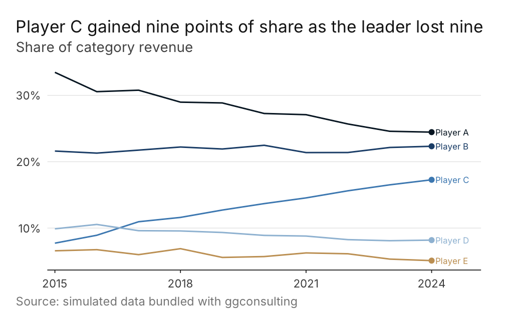
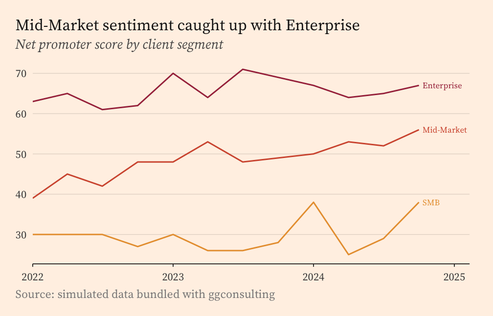
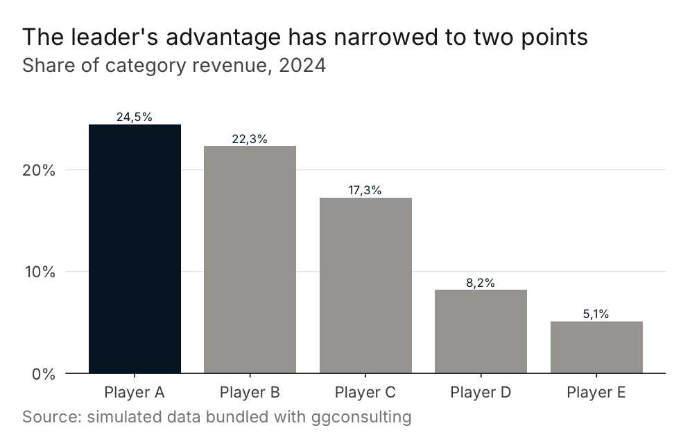

<!-- README.md is generated from README.Rmd. Please edit that file -->

# ggconsulting

<!-- badges: start -->

[](https://lifecycle.r-lib.org/articles/stages.html#experimental)
[](https://www.repostatus.org/#wip)
[](https://github.com/viniciusoike/ggconsulting/actions/workflows/R-CMD-check.yaml)
[](https://app.codecov.io/gh/viniciusoike/ggconsulting)
[](https://opensource.org/licenses/MIT)
<!-- badges: end -->

ggconsulting turns a plain ggplot into slide-ready output. It ships
archetype themes drawn from published business charts, palettes to
match, formatters that speak pt-BR and en-US, and a polish layer that
reads your data to place labels and highlights.

ggconsulting is in early development. The public API is being shaped
against real consulting decks, so expect breaking changes through `0.x`.

The themes require ggplot2 4.0 or later. They lean on `theme_sub_*()`,
`element_geom()`, and `from_theme()`, none of which exist in ggplot2
3.x.

## Installation

Install the development version from GitHub.

``` r
# install.packages("pak")
pak::pak("viniciusoike/ggconsulting")
```

## Quick start

``` r
library(ggplot2)
library(ggconsulting)
#> ✔ ggconsulting set ggplot2 aesthetic defaults
#> ℹ Opt out: `ct_unset_defaults()` or `options(ggconsulting.autoload = FALSE)`
#> ℹ Column width / linewidth: use `ct_col()` / `ct_line()`, or apply a
#>   `theme_*()` archetype for linewidth via `from_theme()`

players <- subset(market_share, company != "Others")

ggplot(players, aes(year, share, colour = company)) +
  ct_line() +
  scale_colour_ct("strategy_navy") +
  scale_y_continuous(labels = fmt_pct(decimals = 0)) +
  scale_x_continuous(
    breaks = seq(2015, 2024, 3),
    expand = expansion(mult = c(0.02, 0.12))
  ) +
  labs(
    title    = "Player C gained nine points of share as the leader lost nine",
    subtitle = "Share of category revenue",
    x = NULL, y = NULL,
    caption  = "Source: simulated data bundled with ggconsulting"
  ) +
  theme_strategy() +
  theme(legend.position = "none") +
  ct_finish(end_labels = TRUE, end_points = TRUE)
```



`ct_finish()` runs after the geoms are built, so it can inspect the
data. Here it finds the last point of each series and drops a dot and a
name beside it. Labelling the lines directly replaces the legend, which
is why the example switches the legend off.

`ct_finish()` would normally widen the x range to make room for those
labels, but it defers to any positional scale you set yourself rather
than replacing it. This example supplies its own `scale_x_continuous()`
to get integer year breaks, so it also supplies the right-hand `expand`
the labels need.

## Themes

`ct_theme()` builds a theme from `palette`, `font`, `density`,
`context`, and `paper`. Three presets cover the archetypes.

- `theme_strategy()` keeps a minimal frame, generous whitespace, and a
  navy default.
- `theme_finance()` sets a serif face and tightens spacing for printed
  pages and pitch books.
- `theme_editorial()` sets a serif face with an italic subtitle and a
  warmer palette.

`paper` sets the figure ground. Pass `"cream"`, `"warm_grey"`,
`"white"`, or any colour R recognises. Because `theme_minimal()` leaves
the panel blank, filling the plot background alone produces a uniform
ground with no seam between panel and plot. Setting `paper` warms the
gridline to match.

``` r
ggplot(client_nps, aes(quarter, nps, colour = segment)) +
  ct_line() +
  scale_colour_ct("editorial_warm") +
  labs(
    title    = "Mid-Market sentiment caught up with Enterprise",
    subtitle = "Net promoter score by client segment",
    x = NULL, y = NULL,
    caption  = "Source: simulated data bundled with ggconsulting"
  ) +
  theme_editorial(paper = "cream") +
  theme(legend.position = "none") +
  ct_finish(end_labels = TRUE)
```



The archetypes forward `...` to `ct_theme()`, so
`theme_editorial(paper = "cream")` works. Cream is opt-in rather than
the editorial default.

## The polish layer

`ct_finish()` reads the built plot and applies the finishing moves you
would otherwise make by hand. It can sort a categorical axis by value,
highlight chosen categories against a muted rest, print value labels,
label line endpoints, move the y axis to the right, and expand the
scales to suit the geom.

``` r
share_2024 <- subset(players, year == 2024)

ggplot(share_2024, aes(company, share)) +
  ct_col() +
  scale_y_continuous(
    labels = fmt_pct(decimals = 0),
    expand = expansion(mult = c(0, 0.15))
  ) +
  labs(
    title    = "The leader's advantage has narrowed to two points",
    subtitle = "Share of category revenue, 2024",
    x = NULL, y = NULL,
    caption  = "Source: simulated data bundled with ggconsulting"
  ) +
  theme_strategy() +
  ct_finish(sort = "desc", highlight = "Player A", values = TRUE, label_fmt = "pct")
```



`highlight` reads the main colour from the theme, so add the theme
before `ct_finish()`. Reverse that order and highlights fall back to a
hardcoded navy.

`end_labels` also accepts `"first_facet"`, which pins every label to the
first panel instead of the panel each series happens to end in.

## Palettes and scales

Palettes come in three families keyed to the archetypes, with several
options in each. Every palette holds six colours, and the first is the
main colour that `ct_theme()` routes through `element_geom(ink = )`.

- `ct_palette()` returns a palette’s colours, or lists the available
  names when called with no arguments.
- `scale_colour_ct()` and `scale_fill_ct()` map discrete data onto a
  palette. They interpolate and warn once the data needs more levels
  than the palette holds.
- `scale_colour_ct_c()` and `scale_fill_ct_c()` cover continuous data,
  with `direction = -1` to reverse.
- `ct_palette_show()` previews one palette, a custom hex vector, or
  every shipped palette at once.

American and British spellings are both exported.

## Locale-aware labels

`ct_locale()` switches the active locale between `"pt-BR"` and `"en-US"`
for the session. It writes to `options(ggconsulting.locale)` and never
touches `Sys.setlocale()`, so output matches across Windows, Linux, and
macOS. The package carries its own month names rather than reading
`LC_TIME`.

``` r
fmt_number()(1234567.8)
#> [1] "1.234.568"
fmt_brl()(c(1234.5, -890))
#> [1] "R$ 1.234,50" "-R$ 890,00"
fmt_month()(as.Date("2024-03-01"))
#> [1] "mar"

ct_locale("en-US")
fmt_number()(1234567.8)
#> [1] "1,234,568"
fmt_month()(as.Date("2024-03-01"))
#> [1] "Mar"
```

`fmt_number()`, `fmt_pct()`, `fmt_delta()`, and `fmt_currency()` all
follow the active locale. `fmt_brl()` always renders Brazilian Real with
`R$` and a non-breaking space whatever the locale, and takes
`style = "accounting"` for negatives in parentheses. Each returns a
function, so they drop straight into the `labels` argument of a scale.

## Geoms and defaults

`ct_col()`, `ct_line()`, and `ct_point()` wrap their ggplot2
counterparts with different defaults for `width`, `linewidth`, and
`size`. Everything else passes through.

Attaching the package also calls `ct_set_defaults()`, which routes a
small set of aesthetic defaults through `update_geom_defaults()`. Turn
it off with `options(ggconsulting.autoload = FALSE)` before loading, or
call `ct_unset_defaults()` mid-session to restore the ggplot2 originals.

One gotcha carries over from ggplot2. `ct_col()`’s `width` counts in
x-axis units, so on a Date axis it means 0.8 *days* and the bars render
as slivers. Convert x to a factor or an index for bar charts.

## Fonts

`has_font()` reports whether a family is available, checking both
installed and session-registered fonts. `install_consulting_fonts()`
fetches the defaults from Google Fonts. It asks before writing to your
home directory unless `options(ggconsulting.font_consent = TRUE)` is
set.

Themes degrade gracefully. `ct_theme()` walks `font` then
`font_fallback` and takes the first family present, so a missing Inter
lands on Helvetica Neue, Arial, or the generic sans rather than failing.

## Documentation

The function reference and further examples live at
<https://viniciusoike.github.io/ggconsulting/>.
