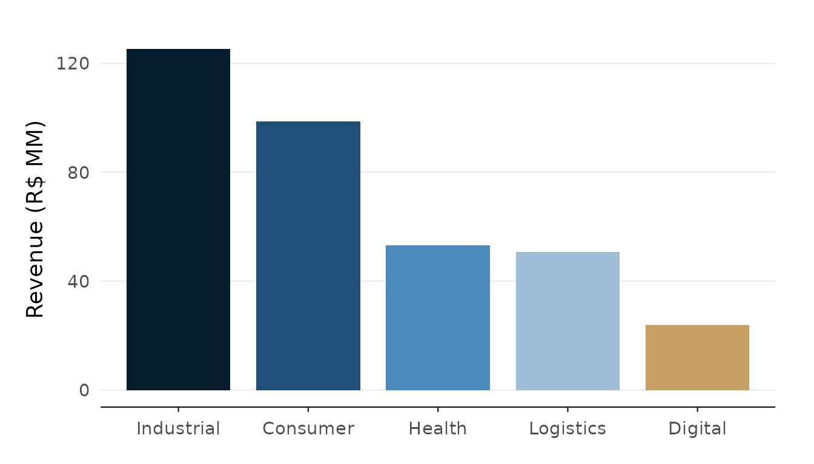
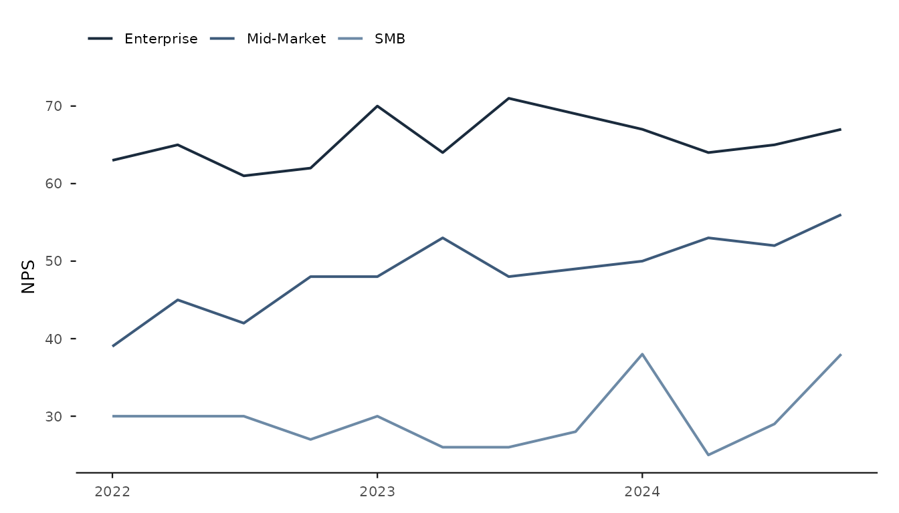
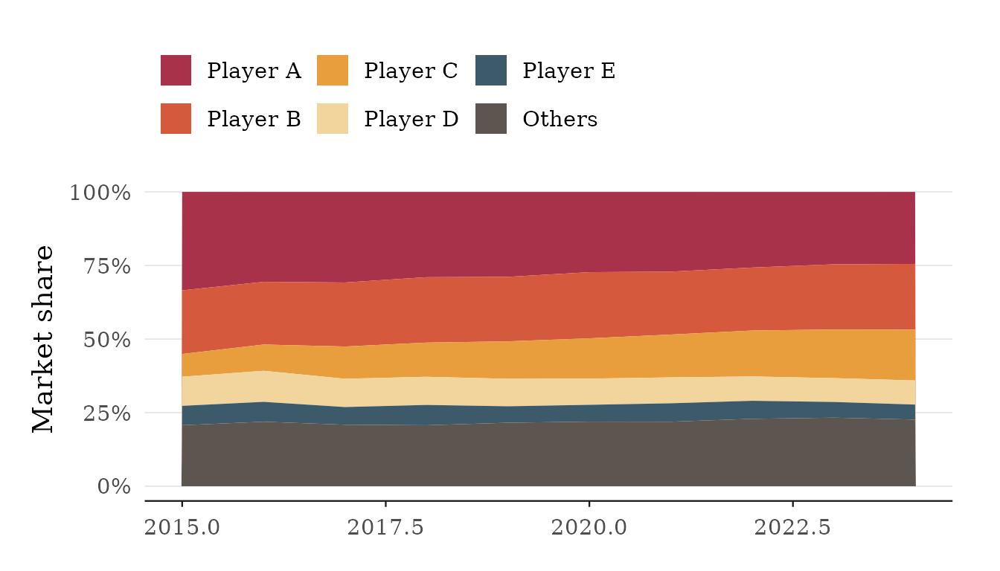
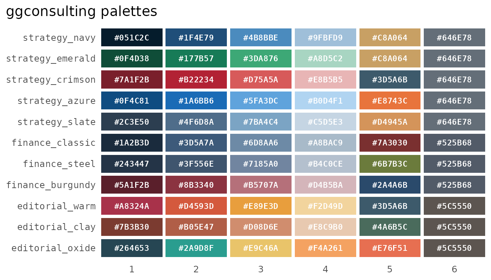
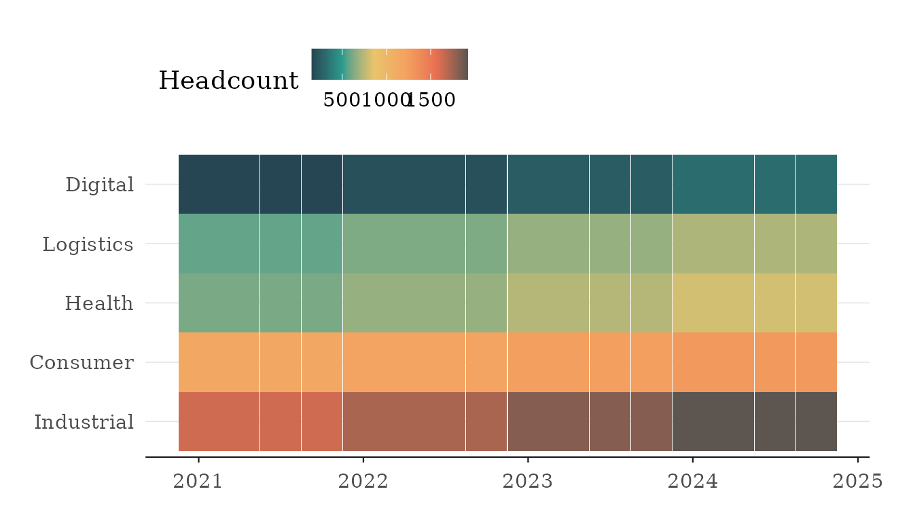

# Themes and palettes

``` r

library(ggplot2)
library(ggconsulting)
```

The package ships three theme presets —
[`theme_strategy()`](https://viniciusoike.github.io/ggconsulting/reference/theme_strategy.md),
[`theme_finance()`](https://viniciusoike.github.io/ggconsulting/reference/theme_finance.md),
and
[`theme_editorial()`](https://viniciusoike.github.io/ggconsulting/reference/theme_editorial.md)
— and colour scales backed by the built-in palettes. This article is a
quick gallery: one small plot per theme, then the scales. All plots use
the bundled datasets.

## Strategy

[`theme_strategy()`](https://viniciusoike.github.io/ggconsulting/reference/theme_strategy.md)
is the minimal, whitespace-heavy preset with a navy palette by default.

``` r

bu_last <- subset(bu_quarterly, quarter == max(quarter))

ggplot(
  bu_last,
  aes(reorder(business_unit, -revenue_brl), revenue_brl, fill = business_unit)
) +
  ct_col() +
  scale_fill_ct() +
  theme_strategy() +
  guides(fill = "none") +
  labs(x = NULL, y = "Revenue (R$ MM)")
```



## Finance

[`theme_finance()`](https://viniciusoike.github.io/ggconsulting/reference/theme_finance.md)
switches to serif type and denser defaults, tuned for reports.

``` r

ggplot(client_nps, aes(quarter, nps, colour = segment)) +
  ct_line() +
  scale_color_ct("finance_classic") +
  theme_finance() +
  labs(colour = NULL, x = NULL, y = "NPS")
```



## Editorial

[`theme_editorial()`](https://viniciusoike.github.io/ggconsulting/reference/theme_editorial.md)
uses serif type with a warmer palette, for analyst notes and commentary.

``` r

ggplot(market_share, aes(year, share, fill = company)) +
  geom_area() +
  scale_fill_ct("editorial_warm") +
  scale_y_continuous(labels = fmt_pct(decimals = 0)) +
  theme_editorial() +
  labs(fill = NULL, x = NULL, y = "Market share")
```



## Scales and palettes

[`scale_color_ct()`](https://viniciusoike.github.io/ggconsulting/reference/ct_scales.md)
/
[`scale_fill_ct()`](https://viniciusoike.github.io/ggconsulting/reference/ct_scales.md)
are discrete and map levels in palette order, interpolating with a
warning past six levels. The `_c` variants are continuous and gradient
across the palette. Any palette name — or any character vector of
colours — pairs with any theme.

``` r

ct_palette_show()
```



``` r

ggplot(bu_quarterly, aes(quarter, business_unit, fill = headcount)) +
  geom_tile(linewidth = 0) +
  scale_fill_ct_c("editorial_oxide") +
  theme_editorial() +
  labs(x = NULL, y = NULL, fill = "Headcount")
```



See the reference pages for `reverse` (discrete) and `direction`
(continuous).
