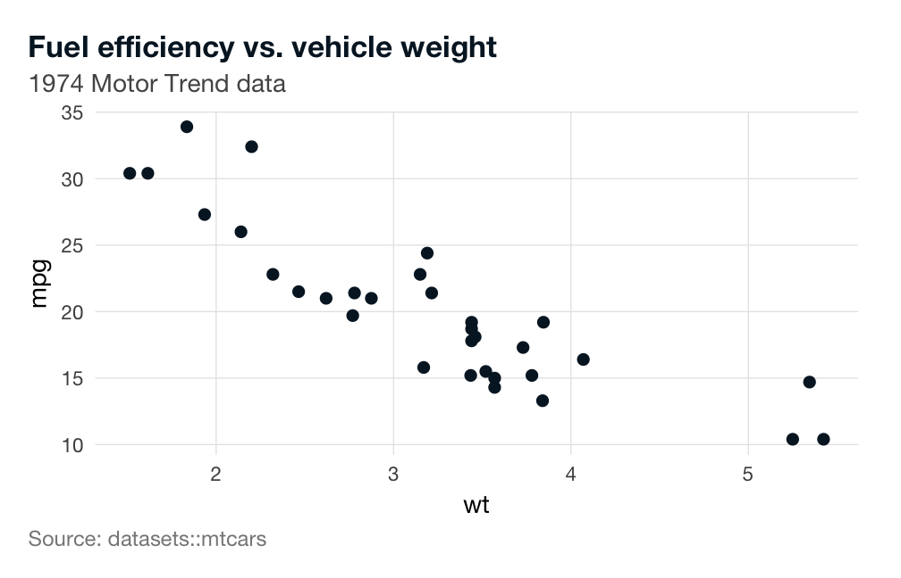

# ggconsulting

An opinionated ggplot2 extension for executive-grade consulting output.
Ships archetype themes, palettes, mechanical geom wrappers, and (in
later releases) locale-aware label helpers and a data-aware polish
layer.

> **Heads up:** ggconsulting is in early development. The public API is
> being shaped against real consulting decks; expect breaking changes
> through `0.x`.

## Installation

The development version from GitHub:

``` r

# install.packages("pak")
pak::pak("viniciusoike/ggconsulting")
```

## Quick start

``` r

library(ggplot2)
#> Warning: package 'ggplot2' was built under R version 4.5.2
library(ggconsulting)
#> v ggconsulting set ggplot2 aesthetic defaults
#> i Opt out: `ct_unset_defaults()` or `options(ggconsulting.autoload = FALSE)`
#> i Column width / linewidth: use `ct_col()` / `ct_line()`, or apply
#>   `ct_theme()`/`theme_strategy()` for linewidth via `from_theme()`

ggplot(mtcars, aes(wt, mpg)) +
  geom_point() +
  labs(
    title    = "Fuel efficiency vs. vehicle weight",
    subtitle = "1974 Motor Trend data",
    caption  = "Source: datasets::mtcars"
  ) +
  theme_strategy()
```



[`theme_strategy()`](https://viniciusoike.github.io/ggconsulting/reference/theme_strategy.md)
routes the palette’s main colour through ggplot2 4.x’s
[`from_theme()`](https://ggplot2.tidyverse.org/reference/aes_eval.html)
mechanism, so unmapped geoms inherit it automatically — no
`scale_color_*()` calls needed for the single-series case.

ggconsulting also sets a small set of aesthetic defaults on
[`library()`](https://rdrr.io/r/base/library.html) attach (currently
`geom_point` `size = 2.5`). Opt out via:

``` r

options(ggconsulting.autoload = FALSE)
# or, mid-session:
ct_unset_defaults()
```

## What’s inside (v0.1 foundation)

- **[`ct_theme()`](https://viniciusoike.github.io/ggconsulting/reference/ct_theme.md)
  /
  [`theme_strategy()`](https://viniciusoike.github.io/ggconsulting/reference/theme_strategy.md)**
  — composable theme builder and archetype preset. Built with ggplot2
  4.x `theme_sub_*()` helpers and routed through
  [`element_geom()`](https://ggplot2.tidyverse.org/reference/element.html)
  for
  [`from_theme()`](https://ggplot2.tidyverse.org/reference/aes_eval.html)
  linkage.
- **Five starter palettes** — `strategy_navy`, `strategy_emerald`,
  `strategy_crimson`, `strategy_azure`, `strategy_slate`.
- **[`ct_col()`](https://viniciusoike.github.io/ggconsulting/reference/ct_geoms.md)
  /
  [`ct_line()`](https://viniciusoike.github.io/ggconsulting/reference/ct_geoms.md)
  /
  [`ct_point()`](https://viniciusoike.github.io/ggconsulting/reference/ct_geoms.md)**
  — mechanical wrappers with consulting-grade defaults for call-site
  overrides.
- **[`ct_set_defaults()`](https://viniciusoike.github.io/ggconsulting/reference/ct_defaults.md)
  /
  [`ct_unset_defaults()`](https://viniciusoike.github.io/ggconsulting/reference/ct_defaults.md)**
  —
  [`update_geom_defaults()`](https://ggplot2.tidyverse.org/reference/update_defaults.html)-driven
  aesthetic baseline with honest revert.

## Roadmap

Next prompts will add `theme_finance()` / `theme_editorial()`
archetypes, `scale_color_ct()` / `scale_fill_ct()`, `ct_finish()` polish
layer, locale-aware label helpers (`fmt_brl`, `ct_locale`),
`install_consulting_fonts()`, vignettes, and a polished gallery.
